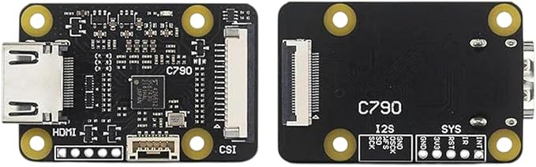
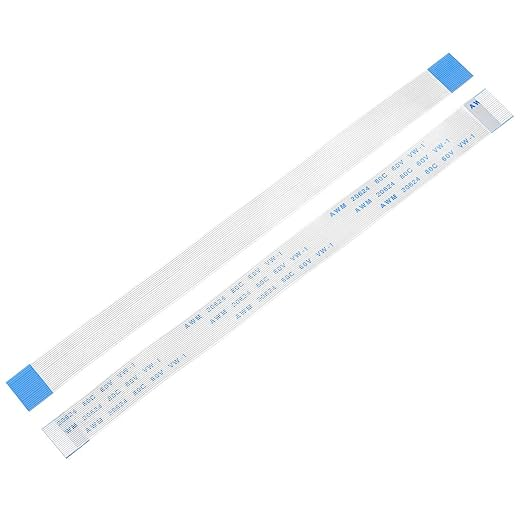
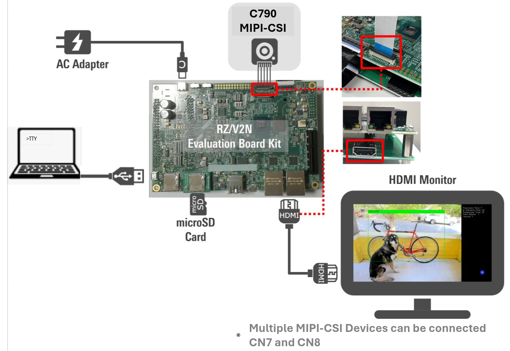
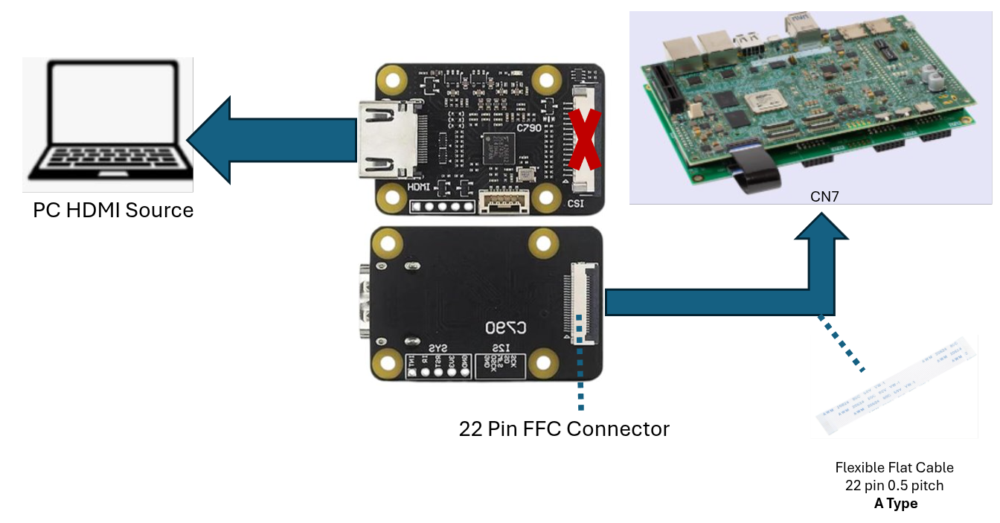

# RZ-V-HDMI-to-MIPI-Device
HDMI to MIPI-CSI Capture Device using the Geekworm C790 ( TC358743 Chip )


### Supported Devices
- RZ/V2N EVK ( minimium AISDK 6.1 )
- RZ/V2H **TDB**

### Requirments
- Linux Kernel v6.1 (Renesas AISDK 6.1 )
- Yocto Scarthgap ( Renesas AISDK 6.1 )
- Geekworm C790 ( TI TC358743 Chip )
- FCC Cable 22 pin 0.5 pitch A Type (copper same sides)
	- **WARNING: Do not use cables that come with C790**

 


### CS790 Features
- HDMI input: supports up to 1080P 60FPS
- HDMI to CSI-2 bridge chip:Toshiba TC358743X
- The CSI-2 interface, with 15 pin FPC seat, spacing 1.0 mm, is located on the front of the C790 module.
-   Not compatible with Renesas EVK
- The CSI-2 interface, with 22 pin FPC seat, spacing 0.5 mm, is located on the back of the C790 module.
-   Compatible with Renesas EVK

## Getting Started
This build process follows the standard Renesas AISDK Yocto Build process and it installs the C790 on all MIPI-CSI interfaces. 

1) Download Renesas RZ/V AISDK Source
	- See the Download link on [How to Build AISDK RZV2N ](https://renesas-rz.github.io/rzv_ai_sdk/latest/howto_build_aisdk_v2n.html)
2) Build the RZ/V AISDK ( Steps 3.1 to 3.10 )
	- [How to Build AISDK RZV2N ](https://renesas-rz.github.io/rzv_ai_sdk/latest/howto_build_aisdk_v2n.html)
	- ***Skip Step 3.5 Adding e-CAM22_CURZH patch***
5) Copy the meta-tc358743 folder to the AISDK YOCTO_WORK directory. The work folder should look like this
```
├── meta-arm
├── meta-openembedded
├── meta-renesas
├── meta-rz-features
├── meta-tc358743 <- added tc358743
├── poky
└── src_setup
```
4) Add meta layer "meta-tc358743" to the AISDK Yocto Build
```
bitbake-layers add-layer ../meta-tc458743
```
5) Continue the Build process ( Step 3.11) in the How to Build AISDK RZV2N
## Running Demo

This meta layer includes scripts that setup the tc358743 for 1080p60 capture. The scripts also include gstreamer commands to stream the captured video to a connected LCD.

 

<br/>
 

1) Connect the Hardware as shown in the image above.
	- Connect the AC Adapter ( 100W required )
	- TTY Serial Terminal 
	- Insert the MicroSD Card
	- Connect the HDMI cable to LCD
		- NOTE: make sure the black expansion cable is connect on the EVK
	- Connect the FFC Cable to the TC358743 and EVK
		- **WARNING: Do not use the FFC that come with the C790**
		- Single Camer use CN7 connector
		- Dual Camera use CN7 and CN8
2) Run the gstreamer script
3) To stop the gstreamer press ``Ctrl-C``
